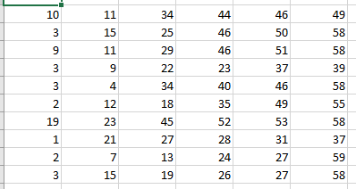

# Gerador de apostas númericas

## Introdução
O projeto <i><b>gerador_de_numeros</b></i> foi desenvolvido com o intuito de que as pessoas que costumam apostar em sorteios, como por exemplo o <b>"Mega da Virada"</b>, não percam muito tempo pensando em números aleatórios para poderem apostar. 
 Esta solução fica ainda mais eficiente em <i>"bolões"</i>, pois nessa circunstância é necessário realizar diversos jogos (sorteios).
 Dessa forma, basta apenas digitar quantos jogos serão feitos e <i><b>Voilà!</b></i>, todos os resultados serão gravados em um arquivo. Basta apenas apostar!

### Imagens do programa
<table>
  <tr>
    <td>É possível gerar os números de acordo com os parametros digitados</td>
     <td>Além de serem gravados em um arquivo de sua escolha (txt ou csv), será apresentado na tela como foi gravado.</td>
  </tr>
  <tr>
    <td></td>
    <td></td>
  </tr>
 </table>
 
### Imagens do arquivo gerado
<table>
  <tr>
    <td>O arquivo quando gravado em .csv, cada valor será fixado em sua respectiva célula.</td>
     <td>Quando gravado em .txt, será separado por espaços.</td>
  </tr>
  <tr>
    <td></td>
    <td></td>
  </tr>
 </table>

Paragrafo

* Lista
* Lista
* Lista

[LINK](https://www.google.com)